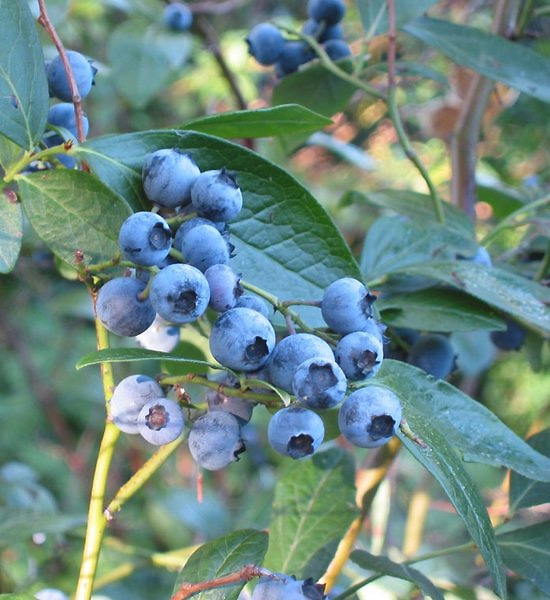
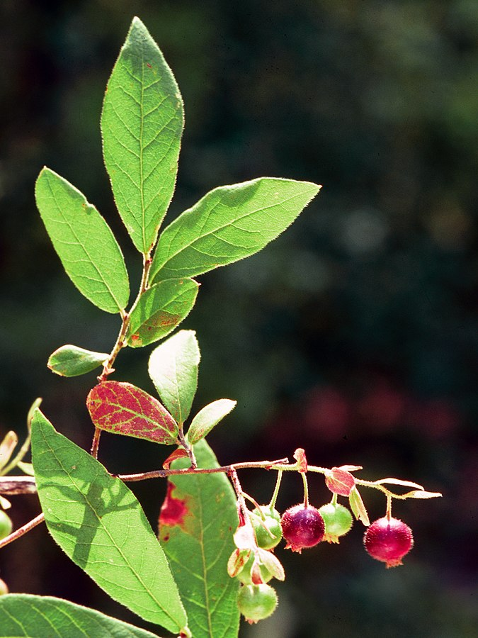

# Welcome!

  

<i> Conservation of Canadian Crop Wild Relatives (CWR) </i> is an app tool that will enable you to explore the diversity of CWR and WUS in Canada. 

Learn more about CWR and WUS on the "What are CWR?" tab. Explore diversity on the "Find Native CWR" and "CWR Conservation" tabs

This tool was designed to accompany a national inventory and conservation assessment of Canada's CWR and WUS diversity, [published here]()

  
  

Image: 

left: Cultivated highbush blueberry, <i> Vaccinium corymbosum </i> [public domain](https://commons.wikimedia.org/wiki/File:Vaccinium_corymbosum(01).jpg)

right: Nationally imperiled CWR of blueberry, <i> Vaccinium stamineum  </i> ("deerberry") [public domain](https://commons.wikimedia.org/wiki/File:Vaccineum_stamineum_1120600.jpg)

You can access our inventory of Canadian CWR and WUS 
[here](https://github.com/jensculrich/Canadian_CWR_inventory_and_conservation/blob/main/Input_Data_and_Files/inventory.csv).

This app has been made with [RShiny](https://shiny.rstudio.com/) and you may
find the code on [github](https://github.com/jensculrich/cwr_shiny_app).

